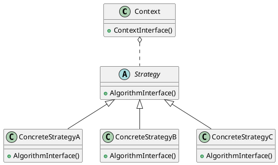

# C#筆記 - 策略模式

[設計模式與遊戲開發的完美結合](https://play.google.com/store/books/details?id=g98dDQAAQBAJ) 的學習筆記。

## [耦合] 維護困難的角色設計(節錄於《設計模式與遊戲開發的完美結合》)

```csharp
// 角色介面
public class Character
{
    // 初始角色
    public void InitCharacter()
    {
        // 依角色類型判斷是最高生命力值的計算方式
        switch (m_CharacterType)
        {
            case ENUM_Character.Soldier:
                // 最大生命力有等級加乘
                if (m_SoldierLv > 0)
                    m_MaxHP += (m_SoldierLv - 1) * 2;
                break;
            case ENUM_Character.Enemy:
                // 不需要
                break;
        }

        // 重設目前的生命力
        m_NowHP = m_MaxHP;
    }

    // 攻擊目標
    public void Attack(ICharacter theTarget)
    {
        // 設定武器額外攻擊加乘
        int AtkPlusValue = 0;

        // 依角色類型判斷是否加乘額外攻擊力
        switch (m_CharacterType)
        {
            case ENUM_Character.Soldier:
                // 不需要
                break;
            case ENUM_Character.Enemy:
                // 依爆擊機率回傳攻擊加乘值
                int RandValue = UnityEngine.Random.Range(0, 100);
                if (m_CritRate >= RandValue)
                    AtkPlusValue = m_MaxHP * 5; // 血量的5倍值
                break;
        }

        // 設定額外攻擊力
        m_Weapon.SetAtkPlusValue(AtkPlusValue);

        // 使用武器攻擊目標
        m_Weapon.Fire(theTarget);
    }

    // 被攻擊
    public void UnderAttack(ICharacter Attacker)
    {
        // 取得攻擊力(會包含加乘值)
        int AtkValue = Attacker.GetWeapon().GetAtkValue();

        // 依角色類型計算減傷害值
        switch (m_CharacterType)
        {
            case ENUM_Character.Soldier:
                // 會依照Soldier等級減少傷害
                AtkValue -= (m_SoldierLv - 1) * 2;
                break;
            case ENUM_Character.Enemy:
                // 不需要
                break;
        }

        // 目前生命力減去攻擊值
        m_NowHP -= AtkValue;

        // 是否陣亡
        if (m_NowHP <= 0)
            Debug.Log("角色陣亡");
    }
}
```

問題：

1. 每個方法都針對「角色類型」進行數值計算，所以這3個方法依賴「角色類型」，當往後又新增「角色類型」時，必須修改這3個方法，因此會增加維護的困難度。
2. 同一類型的計算規則分散在角色類別Character中，不易閱讀及了解，且重複的實作程式碼(switch case)也充滿在類別之中。

**解決方案**：策略模式(Strategy Pattern)。

## 策略模式(Strategy Pattern)

若是小型功能用 if else、switch 就可以完成，但遇到大型、複雜的系統時，需要**長期維護**的專案，採用**策略模式**有利於維護。

> 「定義一群演算法，並封裝每個演算法，讓他們可以彼此交換使用。策略模式讓這些演算法在客戶端使用它們時能更加獨立。」

以生活來看，就是當發生「某情況」時要做出什麼「反應」。在相同的環境下針對不同條件，要進行不同的計算方式：

- 當「購買商品滿399」時，要加送「100元折價券」
- 當「購買商品滿699」時，要加送「200元折價券」
- 當「客人是日本人」時，要「使用日元計價並加手續費1.5%」
- 當「客人是美國人」時，要「使用美元計價並加手續費1%」
- 當「選擇換美金」時，「將輸入的金額乘上美金匯率」
- 當「選擇換日幣」時，「將輸入的金額乘上日幣匯率」

### Strategy UML



- Strategy (策略介面類別)：提供「策略客戶端」可以使用的方法。
- ConcreteStretegyA ~ ConcreteStretegyC (策略實作類別)：不同演算法的實作。
- Context (策略客戶端)：擁有一個 Strategy 型別的物件參考，並透過物件參考取得 想要的計算結果。

## 實作策略模式

AttributeStrategy.cs:

```csharp
using System;
using System.Collections.Generic;
using System.Text;

namespace Pattern_Ch10_Strategy
{
    internal abstract class AttributeStrategy
    {
        protected int _nowHp = 0;
        protected int _maxHp = 0;
        protected int _moveSpeed = 0;

        public int NowHp => _nowHp;
        public int MaxHp => _maxHp;
        public int MoveSpeed => _moveSpeed;

        public abstract void Initialize();
        public abstract int GetAttackValue();
        public abstract void AddDamageValue(int damage);
    }

    internal class SoldierAttribute : AttributeStrategy
    {
        protected int _level = 0;

        public override void Initialize()
        {
            _level = 1;
            _maxHp = 100 + _level * 100;
            _nowHp = _maxHp;
            _moveSpeed = 3;
        }

        public override int GetAttackValue()
        {
            return 10;
        }

        public override void AddDamageValue(int damage)
        {
            _nowHp -= damage;
        }
    }

    internal class EmenyAttribute : AttributeStrategy
    {
        protected int _criticalDamage = 0;
        private Random randomCritical = new Random();

        public override void Initialize()
        {
            _maxHp = 100;
            _nowHp = _maxHp;
            _moveSpeed = 1;
            _criticalDamage = 30;
        }

        public override int GetAttackValue()
        {
            return randomCritical.Next(100) > 90 ? 10 + _criticalDamage : 10;
        }

        public override void AddDamageValue(int damage)
        {
            _nowHp -= damage;
        }
    }
}
```

Character.cs:

```csharp
using System;
using System.Collections.Generic;
using System.Text;

namespace Pattern_Ch10_Strategy
{
    enum CharacterType 
    { 
        None,
        Solider,
        Enemy
    }

    internal class Character
    {
        private CharacterType _type;
        private string _name;
        private AttributeStrategy? _attribute;

        public string Name => _name;

        public Character(CharacterType type, string name)
        {
            _type = type;
            _name = name;
            switch (_type)
            {
                case CharacterType.Solider:
                    _attribute = new SoldierAttribute();
                    break;
                case CharacterType.Enemy:
                    _attribute = new EmenyAttribute();
                    break;
            }
        }

        public void Initialize() 
        {
            if (_attribute != null)
            {
                _attribute.Initialize();

                Console.WriteLine($"{_name}: Hp/MaxHp={_attribute.NowHp}/{_attribute.MaxHp}, Speed={_attribute.MoveSpeed}");
            }
        }

        public void Attack(Character target)
        {
            int attackValue = _attribute != null ? _attribute.GetAttackValue() : 0;
            Console.WriteLine($"{_name} attack {target.Name}, damage={attackValue}");
            target.AddDamage(attackValue);
        }

        public void AddDamage(int damage)
        {
            _attribute?.AddDamageValue(damage);
            Console.WriteLine($"{_name} got damage={damage}, hp={_attribute?.NowHp}/{_attribute?.MaxHp}");
        }
    }
}
```

Program.cs:

```csharp
namespace Pattern_Ch10_Strategy
{
    internal class Program
    {
        static void Main(string[] args)
        {
            Console.WriteLine("Hello, World!");

            Character solider = new Character(CharacterType.Solider, "Sam");
            Character enemy = new Character(CharacterType.Enemy, "BT");
            solider.Initialize();
            enemy.Initialize();
            solider.Attack(enemy);
            enemy.Attack(solider);
        }
    }
}
```
