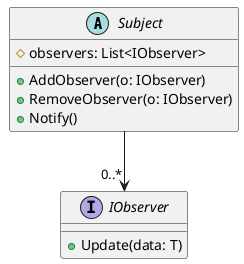
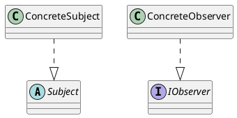

# C#筆記 - 觀察者模式

[設計模式與遊戲開發的完美結合](https://play.google.com/store/books/details?id=g98dDQAAQBAJ) 的學習筆記。

## [耦合] 冗長的遊戲事件通知

```csharp
// Enemy角色介面
public abstract class IEnemy : ICharacter
{
    // 被武器攻擊
    public override void UnderAttack(ICharacter attacker)
    {
        ...

        // 是否陣亡
        if (mAttribute.GetNowHP() <= 0)
        {
            Killed();

            // 通知成就系統
            AchievementSystem.NotifyGameEvent(
                ENUM_GameEvent.EnemyKilled,
                this,
                null);

            // 通知B系統
            ...

            // 通知C系統
            ...

            // 通知D系統
            ...
        }
    }
}
```

問題：

1. `IEnemy` 本來只應該負責「戰鬥邏輯」，但它現在還要知道遊戲裡有哪些系統需要被通知，已經是職責的越界。
    - *成就系統僅關注於某些遊戲事件的發生；而遊戲事件的發生，也不是只提供給成就系統使用。*
    - **違反開放封閉原則 Open/Closed Principle**：每次要新增一個系統需要被通知，都必須修改 `IEnemy` 類別。
2. **依賴方向錯誤**：`IEnemy` 是遊戲核心實體，`AchievementSystem` 是外圍功能，依賴方向應該是外圍依賴核心，而不是反過來。

**解決方案**：觀察者模式(Observer Pattern)！

## 觀察者模式(Observer Pattern)

> GoF對觀察者模式(Observer)的定義為：
>「在物件之間定義一個一對多的連接方法，當一個物件變換狀態時，其它關連的物件都會自動收到通知。」





### 實作觀察者模式(含有泛型)

觀察者、主題的基礎類別設計：

```csharp
public interface ICustomObserver<T>
{
    /// <summary>
    /// 採用推訊息方式(Push)廣播
    /// </summary>
    /// <param name="data"></param>
    public void Update(T data);
}

public abstract class CustomSubject<T>
{
    protected List<ICustomObserver<T>> _observers = new();

    public void AddObserver(ICustomObserver<T> observer) => _observers.Add(observer);

    public void RemoveObserver(ICustomObserver<T> observer) => _observers.Remove(observer);

    public void Notify() 
    {
        foreach (var observer in _observers)
            observer.Update(GetData());
    }

    protected abstract T GetData();
}
```

實作觀察者、主題類別：

```csharp
public class ConcreteSubject : CustomSubject<string>
{
    private string _message = "";

    public string Message { get { return _message; } }

    public void SetMessage(string msg)
    {
        _message = msg;
        Notify();
    }

    protected override string GetData() => _message;
}

public class ConcreteObserver : ICustomObserver<string>
{
    public void Update(string msg)
    {
        Console.WriteLine(msg);
    }
}
```

使用觀察者、主題類別：

```csharp
internal class Program
{
    static void Main(string[] args)
    {
        ConcreteSubject helloSubject = new ConcreteSubject();
        ConcreteObserver observer = new ConcreteObserver();
        helloSubject.AddObserver(observer);
        helloSubject.SetMessage("Hello, World!");
    }
}
```
